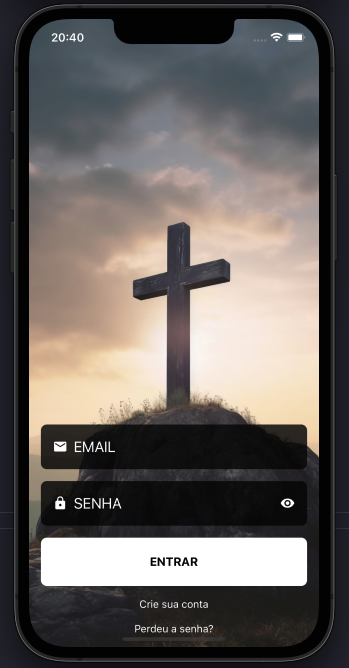

# App - Your Purpose

Para fins de portifólio mobile.




## Índice

- [Visão Geral](#visão-geral)
- [Páginas e Funcionalidades](#Funcionalidades)
- [Tecnologias Utilizadas](#tecnologias-utilizadas)
- [Instalação](#instalação)

## Visão Geral

Para fins de portifólio mobile.

## Tela
 - Login
 - Welcome
 - Home
 - Drawer


## Tecnologias Utilizadas

- React Native
- Expo
- react-hook-form
- Zod
- Typescript

## Instalação

```bash
# NPM
## Clone o repositório
git clone https://github.com/gutomourao05/your-purpose.git

## Entre na pasta
cd your-purpose

## instale as dependencias
npm install

## inicie o app
npm dev

# YARN
## Clone o repositório
git clone https://github.com/gutomourao05/your-purpose.git

## Entre na pasta
cd your-purpose

## instale as dependencias
yarn install

## inicie o app
yarn dev
